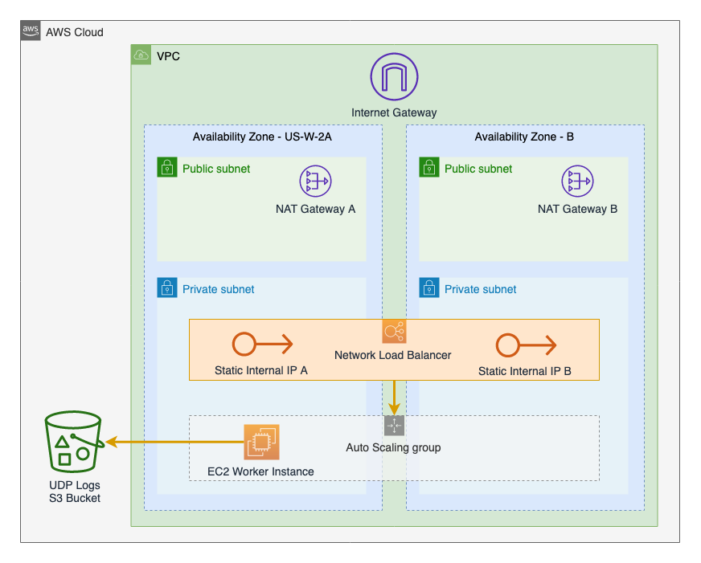
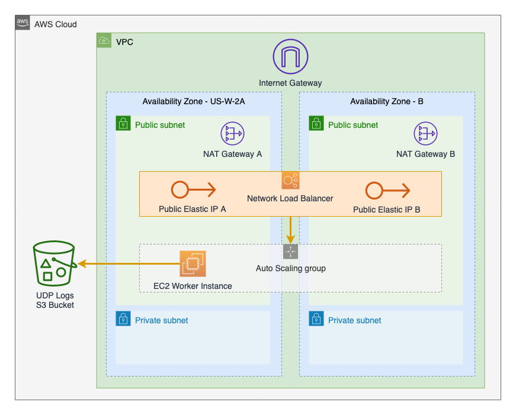

# Logging UDP NLB Demo using CDK
Create a udp logging service that forwards udp logs to s3 using [Fluentd's td-agent](https://www.fluentd.org/faqs) deployed with [Cloud Development Kit (CDK)](https://docs.aws.amazon.com/cdk/latest/guide/home.html)

# Disclaimer
This code is provided as-is and is intended to be an example of how you can use these services and technologies.
This demo will need to be tuned and adjusted to fit in your environment.

# Architecture
This will deploy a [UDP Network Load Balancer (NLB)](https://aws.amazon.com/blogs/aws/new-udp-load-balancing-for-network-load-balancer/). 

The NLB will provide static IP address to configure network devices a stable IP based target for logging. 
By using UDP we will ensure we never cause disruptions for sensitive network devices attempting to contact a log server.

### Default Private Architecture
If you use the default settings this is the architecture of the AWS resources that will be deployed:




### Public Architecture
You can alternatively configure the NLB to deploy to the Public Subnet and use Public IPs by setting `PUBLIC_ACCESS = True` in [cdk_udp_nlb_demo_stack.py](cdk_udp_nlb_demo/cdk_udp_nlb_demo_stack.py)



# Requirements
* Python3.6 
* npm cdk
* AWS account with credentials in your environment to create IAM | VPC | EC2 | etc

# Deploy

#### Prep
* Setup python requirements

```
$ python3 -m venv .env
$ source .env/bin/activate
$ pip install -r requirements.txt
```

#### Configure some settings
The application will deploy without any changes but there are a few settings at the top of [cdk_udp_nlb_demo_stack.py](cdk_udp_nlb_demo/cdk_udp_nlb_demo_stack.py) that you might be interested in.
```
PUBLIC_ACCESS = False  # True to use public NLB and Instances. If NLB is in Public, instances must be public as well.
NLB_ACCESS_IPV4 = "127.0.0.1/32"  # Change this to your public IP for NLB access if you set PUBLIC_ACCESS true
UDP_LISTEN_PORT = 5160  
```

* Synthesize the CDK App
```
$ cdk synth
```

* Deploy your stack
```
$ cdk deploy
```


# Testing the Service
After the stack deploys you may want to testing things out. 

* If you are using Private access you can use SSM to open a session to one of your instances and run the command below.
  * It is important to note that there are 2 instances in the private configuration because you cannot send traffic from an instance to an NLB, then back to the same instance. (this traffic will get dropped)
  * Send the command a few times to ensure one of the messages went to the OTHER instance.
* If you configured Public access you can send traffic to the NLB with the command below.

(The td-agent is configured to accept json messages)
```
echo "{\"timestamp\": `date +%s`, \"message\": \"test message\"}" |nc -u -w1 <your-nlb-ip-or-dns-name> 5160
```

Logs will take about 10 minutes to show up in your S3 bucket. This behavior can be modified in the [td-agent.conf](cdk_udp_nlb_demo/td-agent.conf)  file.


# Tear it down
After you are done testing you can tear down your CDK stack using cdk destroy

```
$ cdk destroy
```

This will leave the s3 bucket in place. You should manually empty and delete the s3 bucket if you are done with the data.
